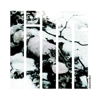
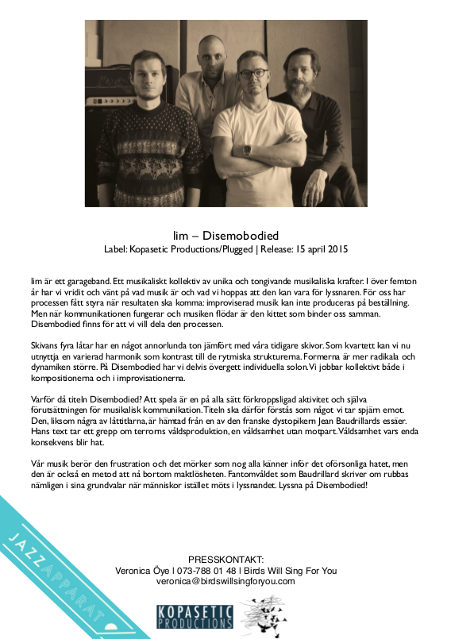

 *Disembodied Violence: Hate* (1995) is the title of an essay by the dystopian French philosopher *Jean Baudrillard* which provides a perspective on the expressions of hate we are surrounded with. To *Baudrillard*, this contemporary form of violence is born of indifference. It has no counterpart, it is blind and it cannot be met by an "equal and opposite violence. Only hate." 

The music on this CD attempts to offer a humble and temporary alternative to the kind of virtual phantom violence that *Baudrillard* discusses. The presence and openness music can offer helps us supersede feelings of powerlessness and move beyond destructive brutality and terror. Hate, "a passion at odds with itself", is destabilized through listening. Listen.

#### Tracks

1. Disembodied Violence 11:15 
2. The Nomad 8:38
3. The Horrible Being 7:14
4. Månens gråa ögon 16:10

#### Press info

