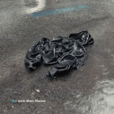

 *lim with Marc Ducret* documents the continued collaboration between Swedish trio lim and French guitarist Marc Ducret. The ongoing collaboration was initiated during kopafestival 2006 and parts of their 2006 performance is also featured on the album *KOPAlectric*, also available on Kopasetic. This new album is the quartet’s first studio recording and was recorded live in front of an audience at Gula Studion in Malmö, Sweden during two nights in November 2010.

lim’s music and unique sound stems from a committed and long-term group effort that was initiated almost fifteen years ago. As a group, lim works long and hard on the music in order to achieve the utmost level of spontaneity within sometimes quite complex structures. This recording also clearly shows that the group has continued to develop and that the core of their expression has crystalized. Despite the complexity of both the compositions and the interplay, lim & Ducret manages to create music that is both organic, original, dynamic and engaging, and that feels personal, vital, creative,challenging and urgent.

This recording is an artistic statement and marks a new take-off for the band in its quartet version.

#### Tracks
1. How Yellow Can This Be
2. My Flower, Your Power
3. The Pointer
4. The Medallion
5. The Tranebird
6. How Black Can It Get
