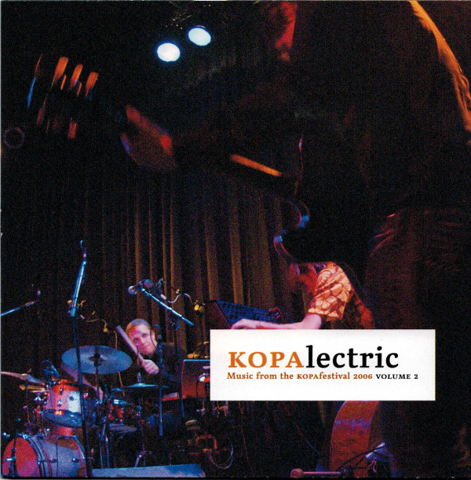

 This is a compilation with three bands performances at the KOPAsetic festival in 2006. This is a quote from Bruce Gallanter's review in Downtown Music Gallery:

This fabulous disc features three ensembles recorded live at the same festival in Malmö, Sweden in September of 2006: Marc Ducret + lim, Anders Nilsson's Aorta and Elektra Hyde. Marc Ducret plays on the first three 10-minute pieces with *lim*. *Gettin' Tage* opens with some strong swirling playing, a spacious interplay between Ducret's guitar and Frisk's tenor sax. Mr.Frisk wrote all three pieces for *lim* and Ducret fits in just right. *Nephilim* is slow, eerie and filled with suspense. Both Ducret and Frisk take some great understated solos. I really dig Frisk's writing, his tunes have a unique way of unfolding slowly so that each note counts like the words in a story. Marc Ducret takes another of his amazing twisted (blues/noise/jazz) guitar solos on *Shulaffel* that just makes me feel so good.

