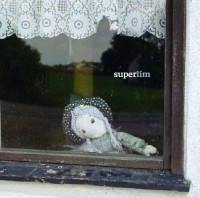

 lim´s most recent CD *superlim* marks the 10th release from Swedish indie label [Kopasetic Productions](http://www.kopasetic.se). The Malmö based trio lim is a group that was formed about 10 years ago by saxophonist Henrik Frisk and drummer Peter Nilsson. Together they were looking for a forum focusing on rhythmical structures as well as rhytmical freedom, and after adding electric bass player David Carlsson (who also makes up for one third of Swedish pop group *The Mopeds*), lim became a strong unit in which they have explored what has since become the groups´ sound.

lim´s cd-debut *lim* (released on [dB-Productions](http://www.db-productions.se) in 2002) was much of a studio production, but the new album focuses on capturing the live aspect and spontaneity of the group. lim´s  music is still largely based on rhythmical concepts, but the sound of the group has evolved into a more acoustic and suggestive one, and the performances on *superlim* has a very strong live feel and precence to them. The fact that lim has chosen to re-interpret a few songs featured on their previous album shows that the group focuses more on the interplay and the interpretation than on composition.
